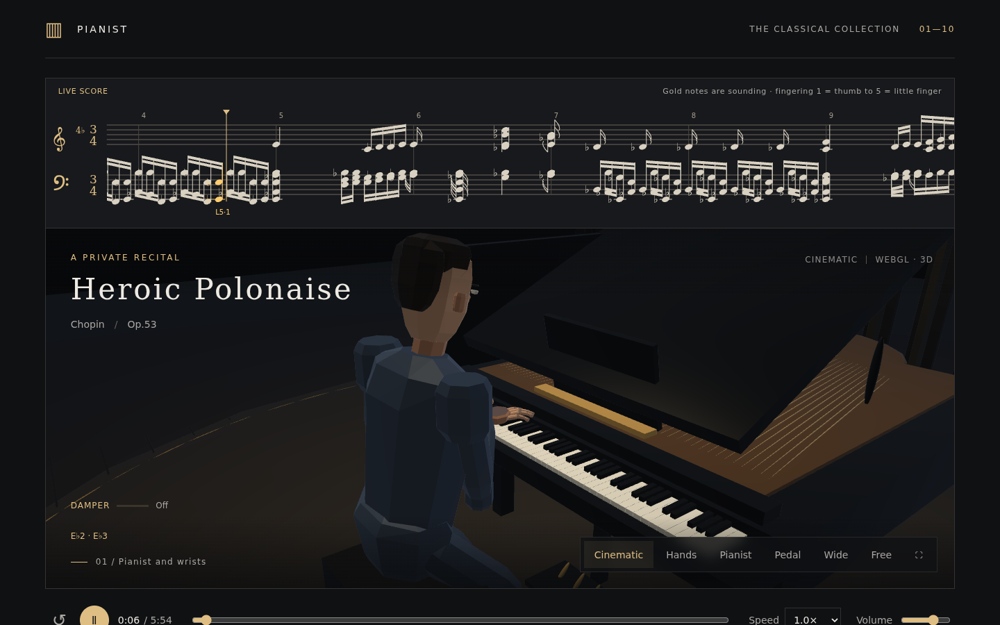
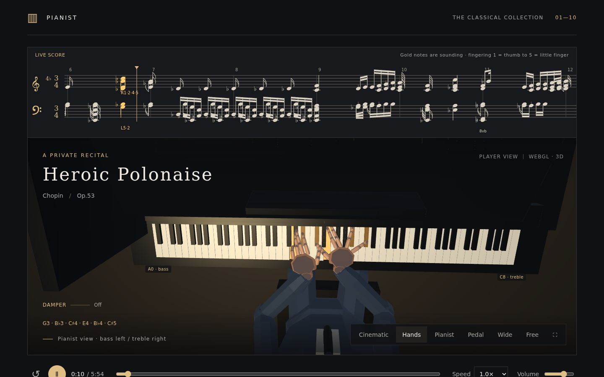

# pianist

Live demo: https://reki2000.github.io/demos-pianist/

A standalone single-file build, `piano-recital.html`, embeds the recorded audio. It is generated by `python pack-v8.py` (not committed) and can be downloaded from the live site as [piano-recital.html](https://reki2000.github.io/demos-pianist/piano-recital.html) or [piano-recital.zip](https://reki2000.github.io/demos-pianist/piano-recital.zip).

Open it in a WebGL-capable browser such as Chrome, Edge, Firefox or Safari and press the play button in the center. No internet connection is required.

## Controls

- Choose one of the ten pieces at the bottom of the page.
- Play/pause, restart, seek, speed and volume controls are available.
- "Cinematic" cuts between five shots in sequence; "Hands" and "Wide" are fixed views. "Pedal" is a close-up of the right foot and damper pedal.
- In "Free", drag to orbit and scroll to zoom.
- Space toggles play/pause; the button at the bottom right switches to fullscreen.

## Program

1. Chopin — Heroic Polonaise, Op. 53
2. Beethoven — Für Elise, WoO 59
3. Beethoven — Moonlight Sonata, 1st movement, Op. 27 No. 2
4. Debussy — Clair de Lune
5. Mozart — Rondo alla Turca, K. 331
6. Bach — Well-Tempered Clavier, Prelude No. 1, BWV 846
7. Chopin — Raindrop Prelude, Op. 28 No. 15
8. Chopin — Revolutionary Étude, Op. 10 No. 12
9. Chopin — Fantaisie-Impromptu, Op. 66
10. Chopin — Prelude in E minor, Op. 28 No. 4

## Synchronization and expression

Each finger (thumb, index, middle, ring, little) has its own fixed segment lengths. Segments never stretch; joints bend to move the finger. PIP and DIP flexion are coupled, and lateral spread and MCP motion are limited. The upper arm and forearm also use fixed-length joint solving.

The next notes are looked ahead so that release, lateral travel and strike form one continuous trajectory. Unused fingers hang loosely while waiting, and only the striking finger descends from there. During thumb crossings the wrist height and orientation change. The fore–aft position on the key is used as well, to reflect the length difference between the middle and little fingers.

The keyboard uses nominal proportions: 23.5 mm white-key pitch, 148 mm exposed white-key length, and black keys 95 mm long, 14 mm wide and 12 mm high, giving a white-to-black length ratio of about 1:0.642. The relative scale of the figure and keyboard was tuned as well.

MIDI voices are not mechanically fixed to one hand; they are redistributed based on the span of simultaneous keys and hand travel distance. The pitch, velocity and note count of every note in all ten pieces are preserved. For the few large chords that exceed one hand's reach and cannot be solved by redistribution, some notes are rolled, shifting sound and keystroke together. This is therefore not a perfectly timing-exact reproduction of the source MIDI.

Audio, fingertips and keys are driven from the Web Audio output clock. Forward lean, lateral weight shift and head nods are derived from dynamics, note density, accents and hand position. Fingering is precomputed and stored, so nothing is recomputed when a piece is selected.

The pianist is a stylized 3D model and the fingering is generated automatically; it is not motion capture of a real performer. The tone is a recorded Steinway grand piano. See `AUDIO-NOTES.md` for details.

Third-party asset licenses (audio and MIDI) are summarized in `THIRD-PARTY-NOTICES.md`.

MIDI: © Bernd Krüger / https://www.piano-midi.de/ — CC BY-NC-SA, for personal and non-commercial use. Please respect the copyright notices in the original MIDI files. Source collection: https://github.com/cheriell/ClassicalPianoMIDI-dataset. For this page the MIDI was converted to note events in seconds plus automatic fingering.

## Pedal

The right (damper) pedal is read from MIDI CC64. Sound, right foot, pedal and the on-screen held/released indicator all follow the same clock. If the pedal is down when a finger lifts, the note keeps ringing with natural decay; releasing the pedal damps it. Keys that are still held do not cut off when the pedal is released. Pressing mid-note, re-pedaling during decay and partial pedaling are supported. The right foot pivots on a fixed heel.

The source data contains no left or middle pedal information, so only the right damper pedal is reflected in audio and motion.

## Verification

Across all ten pieces, every finger segment and the upper/forearm lengths were checked at 515 time points with no stretching. Fingertip positions on the keys, 1,120 frames of in-between motion, 3,276 pedal events, re-pedaling and decay after release, the fixed heel, keyboard proportions, audio/clock sync, play/stop and switching between all ten pieces were verified.

Chromium could not be launched in the original build environment, so a final check of real browser video and audio was not performed there. The download version does not depend on external libraries or network loads.

The multi-file version is `dist/index.html`. Logic verification: `node verify.cjs`. Re-converting the source MIDI for development: `python convert.py`. Re-conversion overwrites the precomputed fingering, so recompute fingering before updating the distribution.

## v3: Polygonal figure and score

The figure's head, torso, hands, joints, limbs and shoes are drawn as faceted polygons. Fingers have three fixed-length segments with PIP/DIP joints, creases and nails. Wrist lift before a strike scales with the square of velocity, and the elbow position changes while preserving fixed arm lengths. While notes are held, contact takes priority and vertical motion is limited.

The grand staff at the top is generated from MIDI and follows the performance clock including tempo changes. Notes matching the sounding pitch and onset are highlighted in gold. MIDI lacks the original voicing, beaming, rests and enharmonic spelling, so this is not a reproduction of the original score; durations are approximated from performance data. The score and controls remain visible in fullscreen.

Verification: audio/keystroke at 60 time points, fixed skeleton at 515, tempo conversion at 515, 1,120 in-between fingering frames, 3,276 pedal events. Real browser rendering and listening were not checked due to environment constraints.

## v4: Thumb, wrist, finger crossing and beaming

The thumb CMC (carpometacarpal) joint was placed on the side of the palm near the wrist. The thumb's three bones are drawn as metacarpal, proximal and distal phalanges; the other four fingers start at the MCP at the front. Thenar thickness, the wrist–palm connection and nail orientation were adjusted.

The palm flexes up and down around the wrist as a fixed pivot, combined with arm motion scaled by keystroke strength. Finger bases follow palm rotation while preserving finger and arm bone lengths.

Fingering for every piece was recomputed: for simultaneous notes, fingers are assigned in order from lower to higher keys. Inter-finger distance is evaluated, and unused fingers lift from the MCP to avoid collisions. In-between motion changes joint angles continuously, suppressing motions where a finger crosses another to chase a previous key. For short ornaments, the key is released before moving to the next hand position. Pitch, onset, velocity and note count are unchanged from v3.

Short notes are beamed per beat (in compound meters, per three eighth notes). Beams do not cross rests or long notes; chords share a stem, and 16th/32nd notes get double/triple beams. Gold noteheads during playback are kept.

Numeric verification: at the strike time of all 20,356 notes, no fingertip order inversions and a minimum finger-skeleton gap of at least 0.014 (world units). Fixed skeleton at 515 points, 244 audio onsets, 1,120 frames of continuous fingering motion, 3,865 beam groups, 3,276 pedal events. Score durations are estimated from MIDI performance data and are not a full reproduction of the original. Real browser rendering and listening were not checked.

Additional tests: `node anatomy-test.cjs`, `node collision-test.cjs`, `node continuity-test.cjs`, `node score-test.cjs`, `node pedal-test.cjs`.

## v5: Correct left/right layout and expressive playing

The pianist faces +Z in the WebGL world, so anatomical right is −X. Plan coordinates (with the pianist's right as +X) are now transformed to WebGL world space at render time, fixing the keyboard, both arms and hands, feet and the right damper pedal at once. Cameras use the same transform. The Hands camera puts the far side of the piano at the top of the screen, so bass is on the left and treble on the right. A0/C8 labels are shown when they fit on screen.

For fast shifts and wide chords, the next figure is looked ahead and the lateral MCP angle changes early to spread the thumb and little finger. A striking finger is not moved, and released fingers get a smooth preparation period. Finger base width and bone lengths are not enlarged. Inter-finger collision avoidance continues.

Wrist flexion grows with dynamics, and hand position is corrected to support the finger bases. This produces wrist and elbow vertical motion during strikes as well. Flexion is limited when the fingertip cannot reach. Preparation of unused fingers and contact of striking fingers are both satisfied.

Head nods, gaze toward the next strike position, and forward lean and lateral weight shift following phrase intensity were added or strengthened. Lighting of clothes and skin was adjusted, and normals under non-uniform scale are transformed correctly so the figure's form reads better. The "Pianist" camera shows head and torso; "Hands" shows fingers, wrists and elbows. Hands adjusts its distance so both hands fit even on narrow screens.

Verification: the world coordinates of all 88 keys and the camera projection in actual WebGL draw calls were inspected, confirming that pitch rises toward the pianist's right, and rises to the right on screen in the pianist-facing Hands view. Finger order and spacing at all 20,356 strikes, fixed skeleton lengths at 515 points, finger spread, wrist, head and torso motion in 595 look-ahead preparation scenes, continuity over 1,120 frames, pitch and onset of 244 notes, and 3,276 pedal events were checked. MIDI pitch, velocity, onset and finger assignment are preserved from v4.

The WebGL shaders, vertex buffers, matrices and draw calls were passed directly to OpenGL ES to render 48 frames, and the form, composition and continuity of the Hands and Pianist views were checked as images. The resulting GIFs (`render-check/*.gif`, generated by `python render-preview.py` and not committed) contain no audio, score or UI. Chromium launch restrictions remained, so final checks of UI interaction and listening in a real browser were not performed.

Additional test: `node expressive-test.cjs`. Capturing render data: `node capture-scene.cjs`; direction check: `node direction-test.cjs`. Rendering checks use Mesa EGL and Python numpy/Pillow and can be reproduced with `python render-egl.py render-check/hands.json render-check/hands.png`. The distributed HTML does not depend on any of these.

## v6: Fingering principles and phrase look-ahead

The research and how it maps to the implementation are summarized in `FINGERING-NOTES.md`. Ergonomic inter-finger spans, thumb passing on black and white keys, outer fingers in chords, back-and-forth figures and the speed of repeated notes are evaluated. Candidates for every attack group are compared with dynamic programming, choosing fingers using the previous two shapes and the upcoming notes. Major scales prefer the standard fingering and distinguish the end of one octave from a continuing octave. The thumb on black keys is not banned outright, and exceptions for chords and octaves are handled.

For notes that continue within one hand position, a shared palm position is searched and the next finger is prepared over its key. This is applied where fixed skeleton lengths, contact, spacing from unused fingers and continuity of in-between motion are all satisfied; otherwise it falls back to an independent hand move. Onset, pitch, velocity, note count and hand assignment are preserved from v5; finger assignment and release/preparation motion were updated.

The score at the top shows "R"/"L" and a number 1–5 for sounding notes. The numbers match the 3D finger assignment: 1 is the thumb, 5 the little finger. This does not reproduce fingerings from the original score or any particular pianist; it is generated automatically to fit the surrounding figures and the model's hand.

Basic scales, ascending/descending runs, multiple octaves, arpeggios, fast/slow repetition, black-key octaves and back-and-forth figures are checked with `node fingering-test.cjs`. Existing contact, skeleton, audio, pedal, beaming and clock checks continue.

Final verification: no fingertip inversions at the strike time of all 20,356 notes; fixed segment lengths and inter-finger spacing checked at 43,959 in-between points. Finger numbers were updated for 8,075 notes, and a shared hand position was adopted for 1,295 figures. Additional in-between motion check: `node transition-test.cjs`.

## v7: Striking from relaxed, hanging fingers

The motion that bent unused fingers back from the base was removed. The MCP idle angle relative to the palm is now 0°, and the distal joints bend slightly so the fingers hang naturally. A striking finger flexes MCP, PIP and DIP downward and returns smoothly to the idle pose within about 100 ms after release. In fast repetition, the return time shortens to fit the interval until the next strike. Even when avoiding contact, the base never lifts beyond the idle angle.

Base flexion and distal flexion are adjusted to white and black key heights, using the actual fore–aft position on the key while preserving fixed segment lengths. Fingers start preparing 55 ms before the next strike and press down over an 18 ms window matching key travel. On release, joints return continuously from the angles at the actual wrist pose. Lateral finger spread, wrist flexion, elbow/torso/head, score and pedal expression continue.

Onset, duration, pitch, velocity, hand assignment and finger number of all 20,356 notes from v6 were matched by SHA-256. Audio and animation still share the same Web Audio clock.

Verification: inter-finger spacing and key contact at every strike, spacing and fixed lengths at 43,959 in-between points, no MCP hyperextension beyond the idle angle across 25,490 finger poses, and continuity over 1,120 frames. Additional check: `node hanging-test.cjs`. The same render data as WebGL was rendered for 48 frames with OpenGL ES. UI interaction and listening in a real browser were not checked in that environment.

## v8: Recorded grand piano

The sound was switched to real Steinway recordings (Splendid Grand Piano). Four recorded layers from soft to loud are blended smoothly so dynamics affect both volume and timbre. Original pitch, onset, velocity, finger numbers and 3D motion are preserved. Damper sustain and decay, small recorded key and pedal noises, subtle computed resonance and reverb, and peak control were added. Selecting or stopping a piece while samples are loading is handled.

The standalone HTML embeds 118 recordings. The multi-file version can be served with `python -m http.server 8000 --directory dist`. Sources, licenses, processing, verification and limitations of the audio are in `AUDIO-NOTES.md`. `python pack-v8.py` writes the combined report to `v8-verification.json`. The preview `piano-audio-preview-v8.mp3` (generated by `python render-audio-preview.py`) is a native-processing approximation using the actual note schedule. Listening in a real browser was not checked.

## v9: Refined figure

The pianist was remodeled for a more elegant look: smooth-shaded surfaces instead of faceted polygons, more natural head-to-body proportions, a combed-back haircut, serene lowered eyes, and a black tailcoat with satin lapels, white shirt front, wing collar, bow tie, white cuffs and gold cufflinks; the tails drape over a tufted leather artist bench. Lighting uses wrapped diffuse and a cool rim light so dark clothing keeps its silhouette. Skeleton, motion, fingering and timing are unchanged.

## Build and deployment

GitHub Actions (`.github/workflows/pages.yml`) runs `node verify.cjs` and `node audio-test.cjs`, builds the standalone HTML and ZIP with `python pack-v8.py`, and deploys `dist/` together with `piano-recital.html`, `piano-recital.zip`, `THIRD-PARTY-NOTICES.md` and `audio-licenses/` to GitHub Pages on every push to `main`.

Generated outputs (standalone HTML/ZIP, verification reports, audio preview and render GIFs) are not committed; see `.gitignore`.
