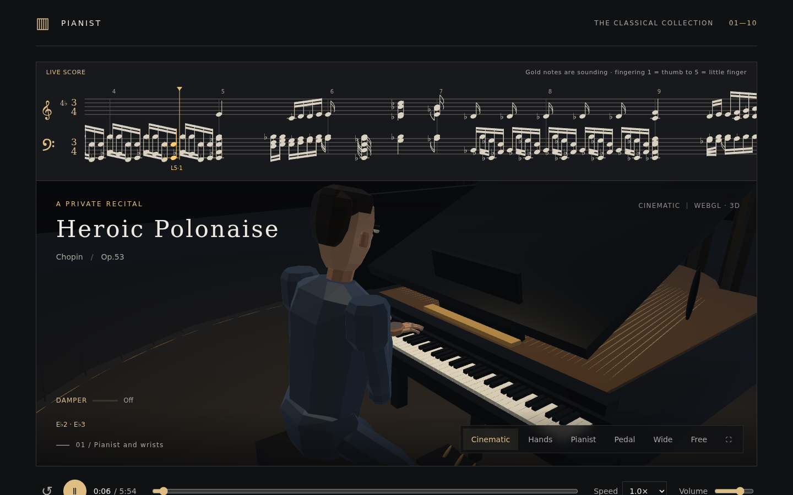

# pianist

Live demo: https://reki2000.github.io/demos-pianist/

A WebGL recital: a stylized 3D pianist plays 18 pieces with automatically generated fingering, synced to a recorded Steinway grand. No motion capture — every keystroke is planned by the motion engine in `dist/motion.js`.

A standalone single-file build, `piano-recital.html` (generated by `python pack-v8.py`, not committed), embeds the audio and needs no internet connection.

## Controls

- Pick one of 18 pieces at the bottom; play/pause, restart, seek, speed, volume.
- Views: Cinematic (5 shots), Hands, Wide, Pedal (damper close-up), Free (drag/scroll).
- Space toggles play/pause; bottom-right button for fullscreen.

## Instruments

The switcher at the top selects Piano / Guitar / Violin / Cello. All four share the song list, transport, cameras and score panel; the piano path is unchanged. The string instruments live in `dist/instruments/` (copies of the demos-guitarist / demos-violinist / demos-cellist modules with host audio, geometry and five-finger bow-hold fixes recorded in `audio-lifecycle-patches.json` / `geometry-patches.json`) and are driven by `dist/instruments/shell.js`; violin and cello scores are drawn by `dist/instruments/staff-score.js` from each module's `scoreConfig`.

| Instrument | Pieces | Sound | Fingering |
|---|---|---|---|
| Piano | 18 | Recorded Steinway samples | `dist/motion.js` |
| Classical Guitar | 6 | Karplus-Strong nylon | Beam search, precomputed (below) |
| Violin | 3 | Bowed-string synth | Position/string engine + bow plan |
| Cello | 4 | Bowed-string synth | Position/string engine + bow plan |

Guitar fingering takes seconds per piece, so plans ship precomputed in `dist/instruments/guitar-plans.js` and are injected before planning; regenerate with `node precompute-guitar-plans.cjs` (it also proves the cached plans reproduce the live plans' poses exactly). Note the renderer mirrors X (`gl.js` `toWorld`): the string modules are authored for that frame, and `node integration-test.cjs` pins the *drawn* figures' handedness (bow/pluck wrist on the anatomical right) against the integrated copies, plus byte-identity with the module repos.

Violin and cello right hands use five articulated digits anchored to the frog, with instrument-specific little-finger placement. References and close-up validation images: [bow-hold verification](docs/verification/bow-hold/README.md).

## Program

Chopin: Heroic Polonaise Op. 53, Raindrop Prelude Op. 28/15, Revolutionary Étude Op. 10/12, Fantaisie-Impromptu Op. 66, Prelude Op. 28/4 · Beethoven: Für Elise, Moonlight Sonata 1st mvt · Debussy: Clair de Lune, Golliwogg's Cakewalk · Mozart: Rondo alla Turca · Bach: WTC Prelude BWV 846 · Satie: Gymnopédie No. 1 · Schumann: Träumerei · Liszt: Liebestraum No. 3 · Joplin: The Entertainer, Maple Leaf Rag · Traditional: When the Saints, Amazing Grace (project arrangements).

Pieces 1–10 and 16–18 are piano-midi.de performances (CC BY-NC-SA); 11–15 are public-domain Mutopia editions or original arrangements. See `THIRD-PARTY-NOTICES.md`.

## Motion

Fingering minimizes unnatural spans (Parncutt et al. 1997 comfortable/practical maxima), lateral splay, and hand travel; free fingers keep a narrower lateral range and stay ordered. Fingers prepare up to 180 ms before a strike and relax over ~160 ms after release; distal joints (PIP/DIP) trail the knuckle (MCP) with a slight phase lag so fingers curl instead of swinging rigidly. Free fingers are eased between frames (`PianoMotion.soften`); bone lengths never change. Wrist lift/flexion, lean, and head nods follow dynamics and phrase intensity. Audio, keys, and fingertips share the Web Audio clock.

MIDI voices are redistributed to two playable hands by span and travel distance; a few unplayable chords are rolled. Pitch, velocity, and note counts are preserved, so timing is not a bit-exact reproduction of the source MIDI.

## Verification

`node verify.cjs` checks all 18 pieces: fixed skeleton at 777 samples, fingertip contact error ≤ ~5 mm, 2,016 continuous in-between frames, pedal events, audio/clock sync, and UI. More: `anatomy/collision/continuity/score/pedal/expressive/direction/fingering/transition/hanging/audio-test.cjs`. `node integration-test.cjs` covers the multi-instrument shell and the string modules' drawn-frame checks. Fingering research: `FINGERING-NOTES.md`; history: `docs/DEVELOPMENT-NOTES.md`.

## Build & dev

- Serve the multi-file build: `python -m http.server 8000 --directory dist`
- After changing `dist/motion.js`: `node add-songs.cjs --replan` (re-plans all 18 pieces), then `node verify.cjs`
- Re-convert source MIDI: `python convert.py` (overwrites fingering — replan afterwards)
- GitHub Actions runs `verify.cjs` + `audio-test.cjs`, builds `piano-recital.html`/`.zip`, and deploys to GitHub Pages on every push to `main`.
